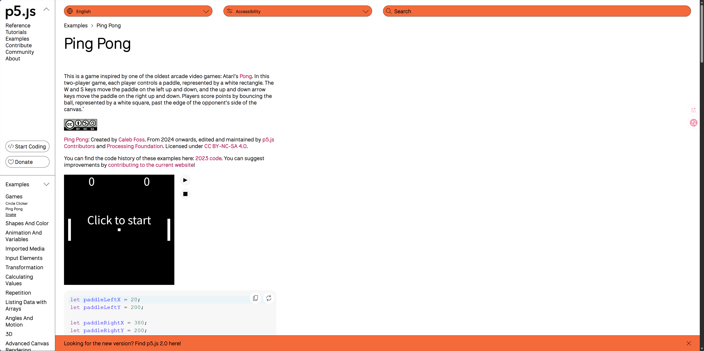

# Quiz 8: Imaging Technique Inspiration and Coding Technique Exploration

## Part 1：Imaging Technique Inspiration

My inspiration comes from p5.js Ping Pong. It uses simple geometric shapes, like two white rectangles as paddles and a white square as the ball. These elements are placed on a dark background, making the motion very clear. It looks relatively simple to make. It doesn't rely on complex images, but its high interactivity keeps users engaged. Since I'm not skilled in art, this simple interactive game gives me a good direction. It also directly corresponds to one dimension of the assignment, "user input."

### Website

[p5.js Ping Pong Example](https://p5js.org/examples/games-ping-pong/)

### Images




---

## Part2：Coding Technique Exploration

In the Ping Pong example, the player moves the paddle up and down with the keyboard. The program also detects whether the ball hits the paddle, the top or bottom walls, or goes past the edges of the canvas. This technique, used in the final project, lets users directly control visual objects on the screen. It can turn static visuals into an interactive experience, allowing user movement to change what happens in the scene. Most importantly, it does so without using complex mathematical formulas to calculate angles!

```js
speedX = -speedX;
vy_new = (ballY - paddleCenterY) / number;
```

In Addition, for the final project, I can also let the user input values so the ball leaves a trail as it moves, effectively drawing.

### Coding Technique Image


### Example Implementation

[p5.js Ping Pong Example](https://p5js.org/examples/games-ping-pong/)